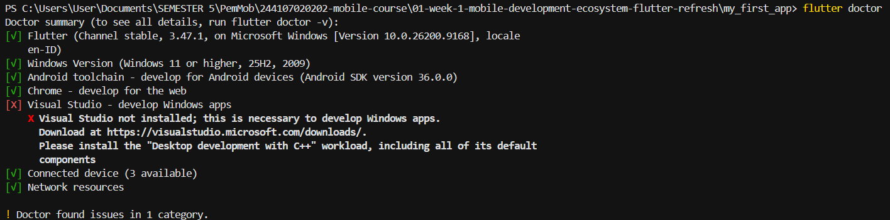
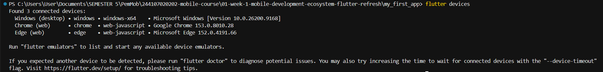
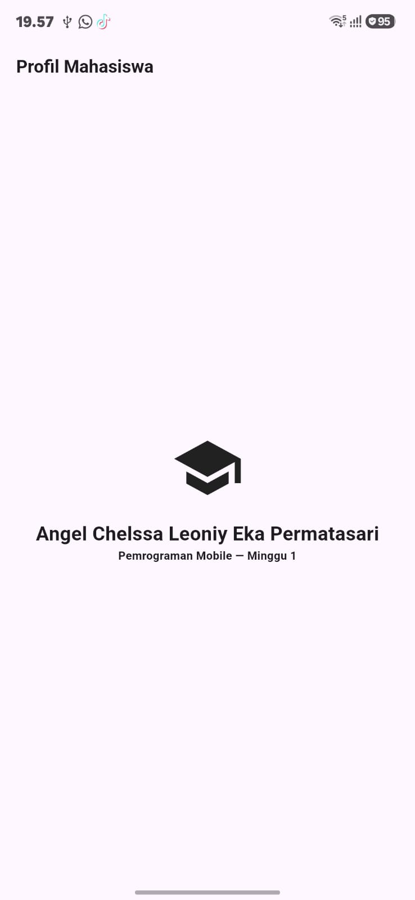
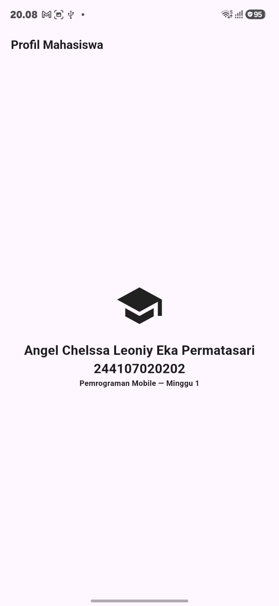

# Pertemuan 1 — Aplikasi Flutter Pertama & Mini Assignment

Nama  : Angel Chelssa Leoniy Eka Permatasari

NIM   : 244107020202

Kelas : TI-3D

## Deskripsi

Ini latihan pertama bikin aplikasi Flutter dari nol. Mulai dari bikin
project baru, jalankan aplikasi contoh bawaan Flutter, sampai ubah
tampilannya jadi halaman **Profil Mahasiswa** sederhana.

## Apa yang dikerjakan

1. Bikin project baru pakai `flutter create`, lalu dijalankan dengan
   `flutter run` di emulator/HP.
2. Tampilan bawaan Flutter (yang biasanya ada tombol counter) diganti
   total, jadi halaman profil yang isinya:
   - Judul di atas: "Profil Mahasiswa"
   - Ikon topi wisuda di tengah
   - Nama lengkap
   - NIM
   - Keterangan mata kuliah ("Pemrograman Mobile — Minggu 1")
3. Semua elemen itu disusun rapi ke bawah pakai satu widget yang
   isinya bisa ditumpuk vertikal, terus diposisikan pas di tengah layar.
4. Dicoba juga dua cara update tampilan:
   - **Hot reload** — tekan `r`, perubahan kode langsung muncul tanpa
     aplikasi harus dibuka ulang dari awal (cepat, cocok buat coba-coba
     tampilan).
   - **Hot restart** — tekan `R`, aplikasi dijalankan ulang dari nol,
     jadi semua yang sempat dibuka/diisi kembali kosong.

## Bukti environment sudah siap

Sebelum mengubah tampilan, dicek dulu apakah Flutter dan perangkatnya
sudah terpasang dengan benar:

<table>
  <tr>
    <td align="center">
      <b>flutter doctor</b> 
      
    </td>
    <td align="center">
      <b>flutter devices</b> 
      
    </td>
  </tr>
</table>

`flutter doctor` menunjukkan semua komponen utama sudah siap (Flutter,
Android toolchain, Chrome, perangkat, dan jaringan). Satu-satunya yang
belum terpasang adalah Visual Studio untuk develop aplikasi Windows —
ini tidak dibutuhkan karena target aplikasinya Android/web, bukan
Windows desktop. `flutter devices` juga berhasil mendeteksi 3 perangkat
(Windows desktop, Chrome, dan Edge) yang bisa dipakai untuk menjalankan
aplikasi.

## Screenshot

<table>
  <tr>
    <td align="center">
      <b>Praktikum (nama saja)</b> 
      
    </td>
    <td align="center">
      <b>Mini Assignment (nama + NIM)</b> 
      
    </td>
  </tr>
</table>

## Refleksi

**Kapan native lebih tepat dipilih daripada cross-platform?**

Pilih native jika membutuhkan performa super cepat (seperti game berat)
atau butuh fitur terbaru dari HP yang belum tentu ada di framework lain.
Pilih cross-platform (seperti Flutter) jika hanya ingin membuat aplikasi
untuk Android dan iOS sekaligus dengan waktu dan biaya lebih hemat,
karena cukup nulis kode sekali saja.

**Bagaimana perubahan state berhubungan dengan widget tree dan UI
deklaratif?**

Ketika state berubah, widget akan dibangun ulang menjadi deskripsi
tampilan yang baru. Framework kemudian membandingkan deskripsi baru ini
dengan tampilan sebelumnya. Hasilnya, hanya bagian yang benar-benar
berbeda saja yang diperbarui di layar.

**Mengapa commit kecil dengan pesan jelas bermanfaat bagi pekerjaan tim
dan portfolio?**

Commit kecil memudahkan orang lain (atau diri sendiri di masa depan)
untuk melihat perubahan apa saja yang terjadi tanpa harus membaca banyak
kode sekaligus. Pesan commit yang jelas juga bikin riwayat project enak
dibaca baik saat kerja tim maupun saat portfolio dilihat orang lain,
karena menunjukkan proses berpikir yang rapi, bukan cuma hasil akhirnya
saja.