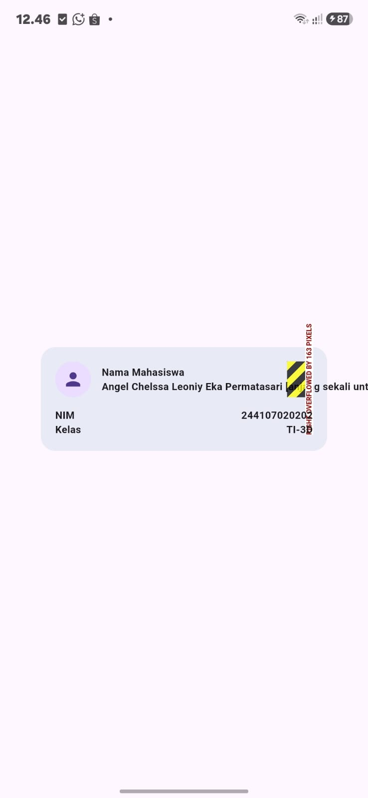

# Pertemuan 2 — Praktikum Layout Sederhana (Warm-up)

Nama  : Angel Chelssa Leoniy Eka Permatasari

NIM   : 244107020202

Kelas : TI-3D

## Deskripsi

Latihan pemanasan sebelum membuat dashboard responsif. Di sini kita belajar
membuat kartu profil sederhana (`ProfileCard`) memakai widget dasar
`Container`, `Row`, `Column`, dan `Expanded` di Flutter.

## Struktur widget

- `ProfileApp` — bagian utama aplikasi (`MaterialApp` + `Scaffold`)
- `ProfileCard` — kartunya sendiri, isinya:
  - `CircleAvatar` (ikon orang)
  - `Column` untuk nama
  - Baris `NIM`, `Kelas`, dan `Email` yang dibuat pakai `Row` + `Expanded`

## Eksperimen warm-up yang dilakukan

### 1. Menghapus `Expanded` pada baris nama

**Sebelum (dengan Expanded):**
```dart
Expanded(
  child: Column(
    crossAxisAlignment: CrossAxisAlignment.start,
    children: const [
      Text('Nama Mahasiswa', style: TextStyle(fontWeight: FontWeight.bold)),
      Text('Angel Chelssa Leoniy Eka Permatasari'),
    ],
  ),
),
```

**Setelah dihapus:**
```dart
Column(
  crossAxisAlignment: CrossAxisAlignment.start,
  children: const [
    Text('Nama Mahasiswa', style: TextStyle(fontWeight: FontWeight.bold)),
    Text('Angel Chelssa Leoniy Eka Permatasari'),
  ],
),
```

**Hasil pengamatan:**
Tampilan jadi berantakan. Muncul garis kuning-hitam di sisi kanan kartu
yang menandakan error **overflow** sebesar 163 pixel. Simpelnya: `Row`
itu punya lebar terbatas (320px, sesuai `Container`). Kalau tidak dikasih
`Expanded`, `Column` di dalamnya jadi "tidak mengikuti batas ruang yang ada" — dia coba
mengambil lebar sepanjang teksnya, padahal ruang yang tersedia tidak
sebesar itu. Karena nama mahasiswanya panjang, teksnya jadi kepotong dan
keluar dari kartu. *(Lihat Screenshot 2 di bagian bawah.)*

### 2. Mengganti `mainAxisSize: MainAxisSize.min` menjadi default

**Sebelum:**
```dart
Column(
  mainAxisSize: MainAxisSize.min,
  children: [...],
)
```

**Setelah (default, tanpa mainAxisSize):**
```dart
Column(
  children: [...],
)
```

**Hasil pengamatan:**
Kalau `mainAxisSize` tidak ditulis, Flutter otomatis memakai nilai
default-nya yaitu `MainAxisSize.max`. Artinya `Column` akan mencoba
memenuhi seluruh tinggi yang tersedia dari induknya (`Center` di
`Scaffold`). Karena `Center` sendiri kasih ruang setinggi layar, kartunya
jadi mengikuti ruangan yang tersedia sampai memenuhi seluruh layar. *(Lihat Screenshot 3 di bagian
bawah.)*

### 3. Menambahkan baris data baru (Email)

Ditambahkan satu baris baru dengan pola yang sama seperti NIM dan Kelas
(`Row` + `Expanded`):

```dart
const Row(children: [
  Expanded(child: Text('Email')),
  Text('angelchelsa150526@gmail.com'),
]),
```

**Hasil pengamatan:**
Baris Email langsung tampil rapi, sejajar dengan baris NIM dan Kelas
yang sudah ada. Ini karena pola `Row` + `Expanded` yang dipakai memang
bisa dipakai berulang-ulang untuk menambah data baru, tanpa perlu
mengubah struktur yang lain. *(Lihat Screenshot 4 di bagian bawah.)*

## Screenshot

<table>
  <tr>
    <td align="center">
      <b>1. Tampilan Normal</b><br>
      
    </td>
    <td align="center">
      <b>2. Overflow (Expanded dihapus)</b><br>
      
    </td>
    <td align="center">
      <b>3. mainAxisSize default</b><br>
      
    </td>
    <td align="center">
      <b>4. Tambah baris Email</b><br>
      
    </td>
  </tr>
</table>