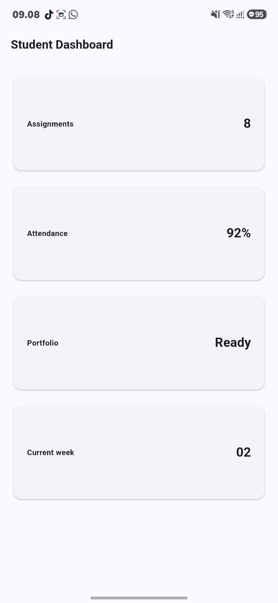
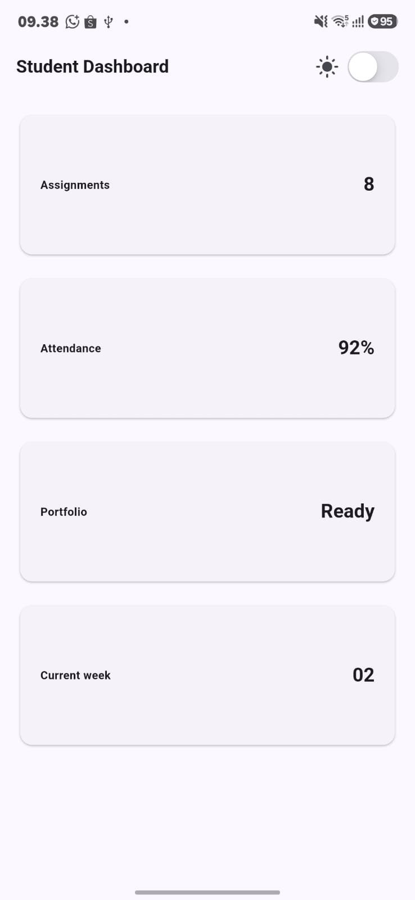
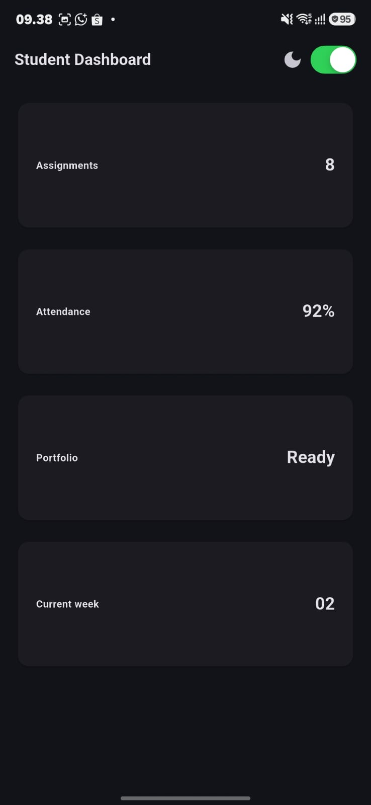
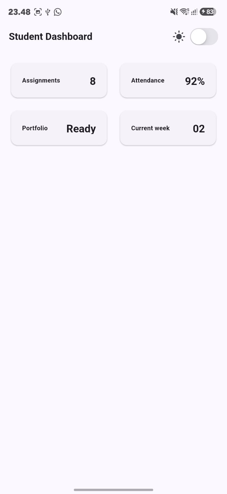
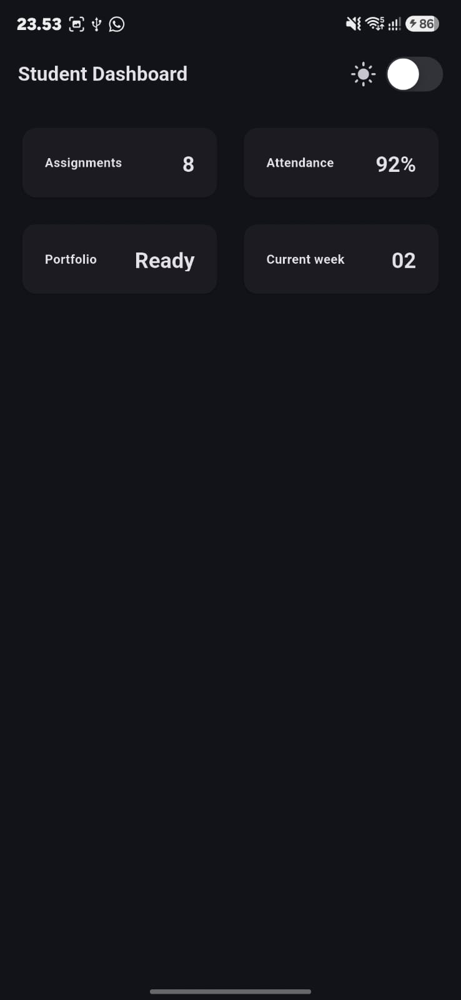
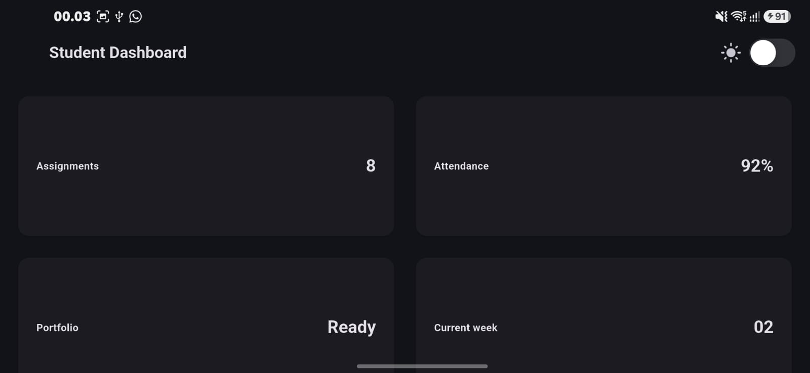
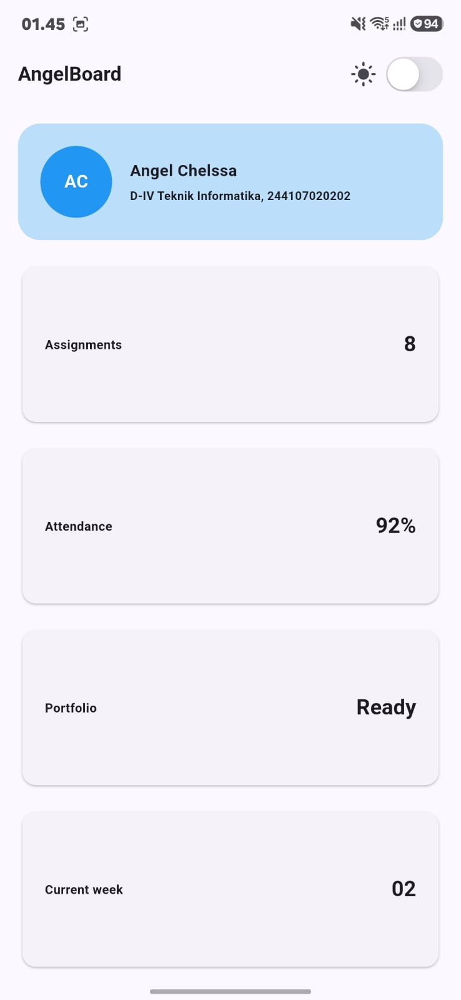
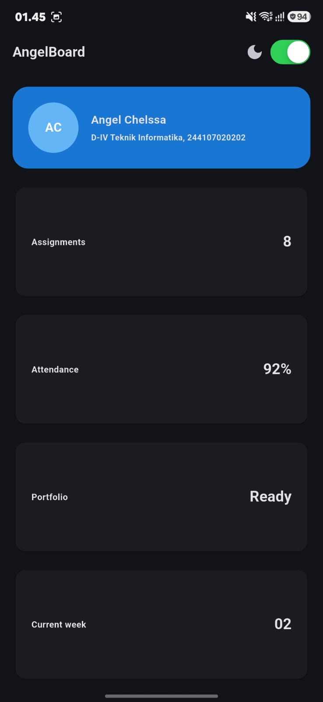
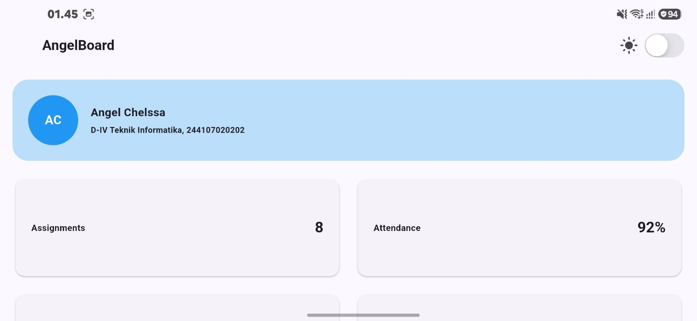
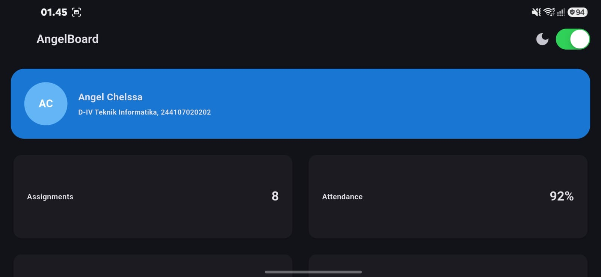

# Tugas Week 2 — Dashboard Responsif & Academic Overview (AngelBoard)

Nama  : Angel Chelssa Leoniy Eka Permatasari

NIM   : 244107020202

Kelas : TI-3D

## Deskripsi

Melanjutkan praktikum kartu profil sederhana, dashboard dikembangkan jadi
dua tahap:

1. **Praktikum dasar** — `Student Dashboard`: grid kartu info yang otomatis
   berubah jumlah kolomnya sesuai lebar layar, plus toggle light/dark
   menggunakan `CupertinoSwitch`.
2. **Tugas utama** — `AngelBoard`: pengembangan dari dashboard di atas
   menjadi halaman *Academic Overview* dengan header profil.

## Struktur widget

- `DashboardApp` (`StatefulWidget`) — menyimpan state `isDark` dan mengatur
  `themeMode`.
- `DashboardPage` — berisi `AppBar` (judul + `CupertinoSwitch`) dan `body`
  memakai `LayoutBuilder` untuk membaca lebar layar.
- `GridView.count` — jumlah kolom mengikuti breakpoint (`1` kolom jika
  `< 700px`, `2` kolom jika `>= 700px`).
- `InfoCard` (hasil refactor dari `DashboardCard`) — widget reusable yang
  menerima `title` dan `value`, dipakai berulang untuk Assignments,
  Attendance, Portfolio, dan Current week.
- Header profil (`AngelBoard`) — `Container` + `Row` berisi `CircleAvatar`
  (inisial "AC") dan `Column` (nama + program studi/NIM), warnanya
  mengikuti `Theme.of(context)` supaya tetap kontras di light & dark mode.

## Fitur yang dipenuhi

- [x] Header profil + 4 kartu informasi (Assignments, Attendance,
      Portfolio, Current week)
- [x] Menggunakan `Row`, `Column`, `Expanded`, dan `Container`
- [x] 1 kolom di layar sempit, 2 kolom di layar lebar (breakpoint 700px)
- [x] Light theme & dark theme dengan toggle (`CupertinoSwitch`)
- [x] Label aksesibilitas (`Semantics`) pada toggle tema dan tiap kartu
- [x] Screenshot layar sempit & lebar, light & dark, disimpan satu folder
      dengan README

## AI Prompt Challenge

Setelah implementasi mandiri selesai, AI dipakai untuk membandingkan
alternatif tata letak dan mengaudit hasil — bukan untuk menulis ulang
kode dari nol.

### 1. Prompt desain
**Prompt:** "Bandingkan dua tata letak dashboard akademik untuk Flutter:
versi `GridView` dan versi `LayoutBuilder` + `Column`. Jelaskan trade-off
responsif dan aksesibilitasnya."

**Ringkasan output AI:**
- `GridView.count` — cocok kalau semua kartu punya ukuran/rasio yang mirip.
  Kelebihannya scroll otomatis ditangani, dan jumlah kolom gampang diatur
  lewat `crossAxisCount`. Kekurangannya, `childAspectRatio` yang tetap bisa
  bikin kartu terlalu pendek/panjang saat teks di dalamnya berubah panjang
  (misal label yang lebih panjang untuk pembaca layar).
- `LayoutBuilder` + `Column`/`Wrap` — lebih fleksibel karena tinggi tiap
  kartu bisa menyesuaikan isinya sendiri (tidak dipaksa `aspectRatio`
  tetap), sehingga lebih aman untuk teks yang di-scale besar (aksesibilitas
  `textScaleFactor`). Kekurangannya, perlu menulis sendiri logika susunan
  kolom dan lebih banyak boilerplate dibanding `GridView.count`.

**Keputusan yang dipilih:** tetap memakai `LayoutBuilder` + `GridView.count`
(gabungan keduanya, seperti kode awal) karena jumlah kartu sedikit dan
seragam, sehingga kelebihan fleksibilitas `Column`/`Wrap` tidak terlalu
diperlukan, sementara `GridView.count` lebih ringkas untuk kasus ini.

### 2. Prompt penguatan konsep
**Prompt:** "Jelaskan kapan penggunaan `Expanded` justru menyebabkan
overflow di dalam `Row`, beri contoh kode yang gagal dan perbaikannya."

**Ringkasan output AI:** `Expanded` menyebabkan overflow saat dipasang pada
lebih dari satu child dalam `Row` yang total `flex`-nya melebihi ruang yang
ada **dan** salah satu child punya `minWidth` intrinsik yang tidak bisa
dikecilkan (misal `Row` di dalam `Row` lain tanpa `Expanded` tambahan), atau
saat `Expanded` dipasang di dalam widget yang bukan turunan `Flex` (seperti
langsung di dalam `Padding`/`Container` tanpa `Row`/`Column` sebagai induk
langsung) — ini sebenarnya error compile, bukan overflow runtime.
Contoh kasus overflow runtime: dua `Expanded` dengan `Text` panjang tanpa
`overflow: TextOverflow.ellipsis`, dikombinasikan dengan `mainAxisSize`
yang salah. Perbaikannya adalah memberi `flex` yang proporsional dan
menambahkan `overflow: TextOverflow.ellipsis` atau `softWrap: true` pada
`Text` di dalamnya.

**Verifikasi:** kartu `InfoCard` sudah diuji dengan judul yang sengaja
dibuat panjang; teks tetap terbungkus rapi karena `Expanded` membatasi
lebar `Text` judul, sesuai temuan di eksperimen warm-up sebelumnya.

### 3. Verification prompt
**Prompt:** "Periksa kembali rekomendasi layout di atas: apakah tetap
responsif di bawah 600px, apakah mengurangi aksesibilitas, dan apakah ada
widget yang tidak tersedia di Flutter stabil saat ini?"

**Ringkasan output AI & tindak lanjut:**
- Di bawah 600px, `GridView.count(crossAxisCount: 1)` tetap aman karena
  breakpoint sudah diatur di 700px — dicek langsung lewat widget test
  ukuran 400×800.
- Tidak ada penurunan aksesibilitas selama label `Semantics` tetap
  dipasang manual pada toggle dan kartu, karena `GridView.count` sendiri
  tidak menghapus struktur semantik anak-anaknya.
- Semua widget yang dipakai (`GridView.count`, `LayoutBuilder`,
  `CupertinoSwitch`, `Semantics`) sudah termasuk dalam Flutter stable,
  tidak ada API eksperimental yang dipakai.

## Refactoring yang dilakukan

- [x] Kartu info diekstrak jadi widget reusable `InfoCard(title, value)`
- [x] Warna dan ukuran hardcode diganti memakai `Theme.of(context)`
- [x] Breakpoint dipindah ke `const kWideBreakpoint = 700;`
- [x] `flutter analyze` dijalankan, tidak ada error/warning baru

## Testing

Widget test disimpan di folder `test/`, memverifikasi:
- Dashboard tampil 1 kolom saat lebar layar `400px` (`< 700`)
- Dashboard tampil 2 kolom saat lebar layar `1200px` (`>= 700`)

Dijalankan dengan `flutter test` — kedua test lulus sebelum dikumpulkan.

## Screenshot

### Praktikum: Student Dashboard (dasar)

<table>
  <tr>
    <td align="center"><b>Sempit — light (awal)</b> </td>
    <td align="center"><b>Sempit — light + toggle</b> </td>
    <td align="center"><b>Sempit — dark</b> </td>
  </tr>
  <tr>
    <td align="center"><b>Lebar — light, 2 kolom</b> </td>
    <td align="center"><b>Lebar — dark (themeMode)</b> </td>
    <td align="center"><b>Lebar — dark (tablet)</b> </td>
  </tr>
</table>

### Tugas utama: AngelBoard (Academic Overview)

<table>
  <tr>
    <td align="center"><b>Sempit — light</b> </td>
    <td align="center"><b>Sempit — dark</b> </td>
  </tr>
  <tr>
    <td align="center"><b>Lebar — light, 2 kolom</b> </td>
    <td align="center"><b>Lebar — dark, 2 kolom</b> </td>
  </tr>
</table>

## Checklist verifikasi

- [x] `flutter analyze` tidak menghasilkan error
- [x] `flutter test` lulus semua widget test responsif
- [x] Aplikasi berjalan di layar sempit maupun lebar
- [x] Dark mode punya kontras dan teks yang terbaca
- [x] Struktur widget bisa dijelaskan saat code review
- [x] Screenshot, folder `test/`, dan README tersimpan di folder tugas
      Week 2