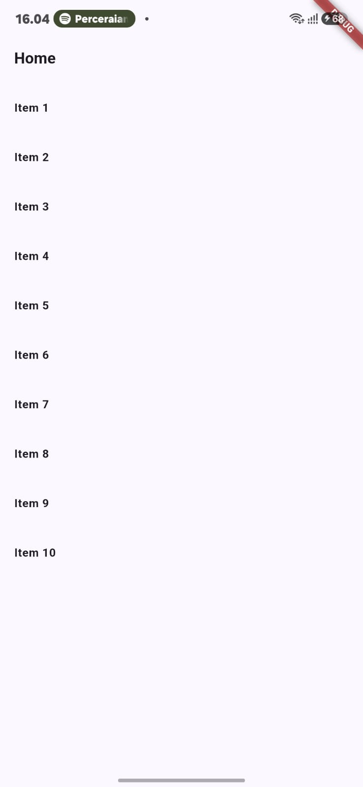
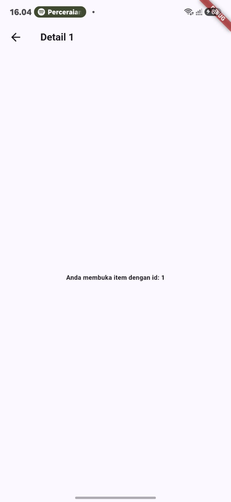

# Praktikum 1 — Multi-Page Navigation dengan GoRouter

Navigasi antar halaman (Home → Detail) menggunakan `go_router` dengan path parameter `:id`.

## Setup

```bash
flutter create week3_navigation
cd week3_navigation
flutter pub add go_router
```

## Kode

**lib/main.dart**
```dart
final _router = GoRouter(
  initialLocation: '/',
  routes: [
    GoRoute(
      path: '/',
      builder: (context, state) => const HomePage(),
      routes: [
        GoRoute(
          path: 'detail/:id',
          builder: (context, state) => DetailPage(
            id: state.pathParameters['id']!,
          ),
        ),
      ],
    ),
  ],
);

class MyApp extends StatelessWidget {
  const MyApp({super.key});
  @override
  Widget build(BuildContext context) {
    return MaterialApp.router(
      routerConfig: _router,
      theme: ThemeData(colorSchemeSeed: Colors.indigo, useMaterial3: true),
    );
  }
}
```

**lib/pages/home_page.dart**
```dart
class HomePage extends StatelessWidget {
  const HomePage({super.key});
  @override
  Widget build(BuildContext context) {
    return Scaffold(
      appBar: AppBar(title: const Text('Home')),
      body: ListView.builder(
        itemCount: 10,
        itemBuilder: (context, index) => ListTile(
          title: Text('Item ${index + 1}'),
          onTap: () => context.go('/detail/${index + 1}'),
        ),
      ),
    );
  }
}
```

**lib/pages/detail_page.dart**
```dart
class DetailPage extends StatelessWidget {
  final String id;
  const DetailPage({super.key, required this.id});
  @override
  Widget build(BuildContext context) {
    return Scaffold(
      appBar: AppBar(title: Text('Detail $id')),
      body: Center(child: Text('Anda membuka item dengan id: $id')),
    );
  }
}
```

## Hasil

| Home | Detail |
|---|---|
|  |  |

Path berubah sesuai layar aktif (`/` → `/detail/1`) dan `/detail/1` bisa diakses langsung tanpa lewat Home — ini keunggulan router deklaratif dibanding Navigator 1.0.