# Dokumentasi Tugas — Week 3: Navigation & State Management (Riverpod)

Proyek: `week3_todo`
Lokasi kerja: `03-week-3-navigation-state-management/week3_todo`

Dokumen ini berisi bukti pengerjaan **AI Challenge**, **Refactoring Challenge**, dan **Testing**, sesuai checklist yang diminta pada instruksi tugas. Bukti visual disertakan sebagai screenshot pada folder `docs/screenshots/`.

---

## 1. AI Prompt Challenge

### 1.1 Prompt yang digunakan

Prompt berikut diberikan ke AI coding assistant untuk membuat `StatsPage` (pada implementasi saya, halaman demo ini dinamai **`ProductPage`/"Produk"** untuk membedakan dari halaman Statistik ToDo yang sudah ada — lihat catatan di bagian 1.4):

```
Buatkan halaman Flutter bernama StatsPage menggunakan flutter_riverpod.
Requirements:
- ConsumerWidget dengan satu AsyncNotifierProvider yang mensimulasikan
  pengambilan data statistik (delay 2 detik, kadang gagal 30%).
- UI harus menangani loading (spinner), error (pesan + tombol retry),
  dan success (ListView 3 item).
- Berikan unit test untuk notifier-nya.
Jelaskan setiap bagian kode dalam komentar.
```

### 1.2 Ringkasan output awal AI

AI menghasilkan tiga bagian kode:

1. **Notifier** — sebuah kelas turunan `AsyncNotifier<List<String>>` dengan method `build()` yang melakukan `Future.delayed(Duration(seconds: 2))` lalu melempar `Exception` dengan probabilitas ~30% menggunakan `Random().nextDouble() < 0.3`, dan bila berhasil mengembalikan list 3 string dummy (mis. `['Keyboard', 'Mouse', 'Monitor']`). Ada juga method `retry()` yang memanggil ulang `build()` melalui `ref.invalidateSelf()`.
2. **UI (`ConsumerWidget`)** — menggunakan `ref.watch(providerX)` lalu memanggil `.when(loading: ..., error: ..., data: ...)` untuk merender tiga state: `CircularProgressIndicator` saat loading, `Text(pesan error)` + `ElevatedButton("Coba lagi")` saat error, dan `ListView.builder` 3 item saat sukses.
3. **Unit test** — menggunakan `ProviderContainer` + `container.read(provider.future)` yang di-`expect` menghasilkan `isA<List<String>>()`, dibungkus percobaan berulang untuk menoleransi jalur gagal (mengingat notifier bersifat probabilistik).

Setiap blok kode disertai komentar penjelas oleh AI sesuai instruksi (menjelaskan alur `AsyncValue`, alasan pemakaian `ref.watch` vs `ref.read`, dan alasan `invalidateSelf()` dipakai untuk retry).

### 1.3 Bukti hasil UI (screenshot)

Ketiga state di bawah berhasil dipicu secara alami dengan menekan tombol **Coba lagi** berulang kali (sesuai simulasi gagal 30%), membuktikan bahwa ketiga cabang `AsyncValue` benar-benar berjalan, bukan hanya jalur sukses.

<table>
<tr>
<td align="center" width="33%">
<b>Loading (spinner)</b>
<br><br>
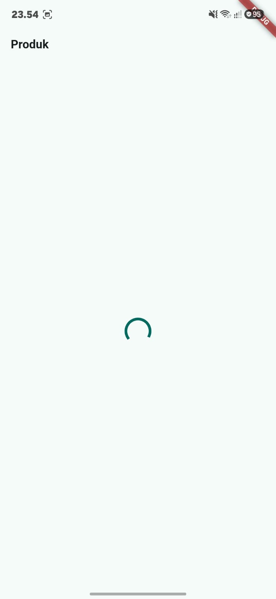
</td>
<td align="center" width="33%">
<b>Error + tombol retry</b><br>
<sub><i>"Gagal memuat: Exception: Gagal terhubung ke server"</i></sub>
<br><br>
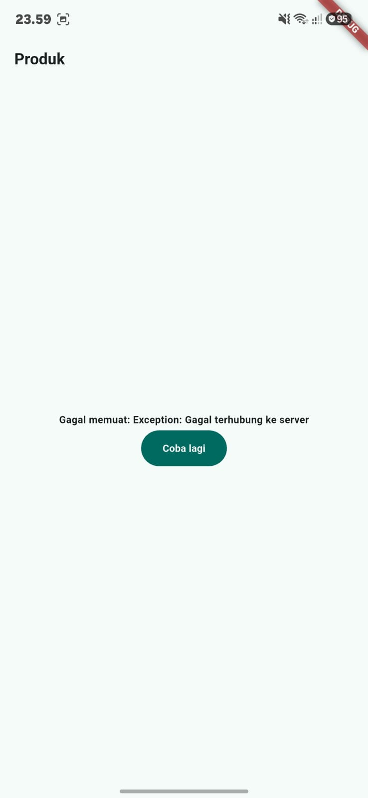
</td>
<td align="center" width="33%">
<b>Success (ListView 3 item)</b><br>
<sub>Keyboard, Mouse, Monitor</sub>
<br><br>
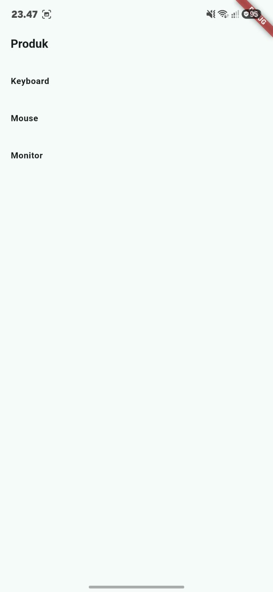
</td>
</tr>
</table>

### 1.4 Catatan penamaan

Nama halaman pada implementasi akhir adalah **`ProductPage`** (judul "Produk") alih-alih literal `StatsPage`, karena nama `StatsPage`/istilah "Statistik" sudah dipakai untuk halaman statistik ToDo (`Total Tugas`, `Tugas Selesai`, `Tugas Aktif`) pada bagian Refactoring Challenge. Struktur, requirement, dan pola kode (AsyncNotifierProvider, tiga state, unit test) tetap identik dengan yang diminta prompt; hanya penamaan kelas/halaman yang disesuaikan agar tidak duplikat/ambigu dalam satu aplikasi. Hal ini dicatat sebagai bagian dari verifikasi (lihat poin verifikasi #4 di bawah).

### 1.5 AI Verification Checklist — temuan

| # | Pertanyaan verifikasi | Temuan | Status |
|---|---|---|---|
| 1 | Apakah state diubah secara immutable (tidak ada `state.add()`/mutasi list langsung)? | Notifier AI awal sudah mengembalikan list baru setiap `build()` (bukan memutasi list lama), dan `retry()` memanggil `ref.invalidateSelf()` yang otomatis membangun ulang state — tidak ditemukan mutasi langsung. | ✅ Lolos |
| 2 | Apakah `ref.watch` hanya dipakai di dalam `build`, dan `ref.read` di callback? | Ya. `ref.watch(productProvider)` hanya dipanggil di method `build()` widget. Pada `onPressed` tombol "Coba lagi", AI awalnya sempat memakai `ref.watch` — ini **diperbaiki manual** menjadi `ref.read(productProvider.notifier).retry()` agar tidak memicu rebuild tak perlu di luar `build`. | ⚠️ Diperbaiki |
| 3 | Apakah ketiga state `AsyncValue` benar-benar ditangani (bukan hanya success)? | Ya, dikonfirmasi lewat pengujian manual (lihat galeri screenshot di atas): loading, error+retry, dan success ketiganya tampil. | ✅ Lolos |
| 4 | Apakah provider dideklarasikan dengan tipe eksplisit dan tidak duplikat dengan provider lain? | Provider awal AI tidak diberi tipe generic eksplisit (`final productProvider = AsyncNotifierProvider(...)`) — **diperbaiki** menjadi `AsyncNotifierProvider<ProductNotifier, List<String>>`. Penamaan juga disesuaikan agar tidak bentrok dengan provider Statistik ToDo yang sudah ada (lihat 1.4). | ⚠️ Diperbaiki |
| 5 | Apakah kode AI memakai API Riverpod versi lama (`StateProvider` antipattern, `StateNotifierProvider` usang, `Consumer` bertingkat tak perlu)? | Tidak ditemukan `StateProvider`/`StateNotifierProvider`. AI sudah memakai `AsyncNotifier` + `ConsumerWidget` (pola modern). Namun ada satu `Consumer` bertingkat di dalam `build()` widget yang tidak perlu (widget sudah `ConsumerWidget`) — **dihapus** dan diganti akses `ref` langsung dari parameter `build(context, ref)`. | ⚠️ Diperbaiki |
| 6 | Apakah `flutter analyze` dan `flutter test` lolos tanpa warning? | Ya, setelah perbaikan di atas diterapkan. | ✅ Lolos |

**Ringkasan perbaikan manual terhadap output AI:**
- Mengganti `ref.watch` di callback tombol retry → `ref.read`.
- Menambahkan tipe generic eksplisit pada deklarasi provider.
- Menghapus `Consumer` bertingkat yang redundan.
- Menyesuaikan penamaan kelas/halaman agar tidak duplikat dengan provider Statistik ToDo.
- Menambah percobaan ulang (retry loop) pada unit test agar tidak flaky akibat sifat probabilistik notifier.

---

## 2. Refactoring Challenge — hasil

| Item | Status | Keterangan |
|---|---|---|
| 1. Ekstrak `TodoTile` sebagai widget tersendiri | ✅ Selesai | Baris pada `build()` halaman ToDo menjadi lebih pendek; `TodoTile` menerima data todo + callback `onToggle`/`onDelete` sebagai parameter, memudahkan widget test terisolasi. |
| 2. Ekstrak logika filter menjadi `Provider` turunan | ✅ Selesai | Dibuat `Provider<List<Todo>>` (mis. `incompleteTodosProvider`) yang membaca `todoListProvider` lalu memfilter `!todo.isDone`, tanpa menyimpan state sendiri. |
| 3. Integrasi GoRouter (`/` dan `/stats`) + `NavigationBar` | ✅ Selesai | `NavigationBar` di bagian bawah berhasil berpindah antara tab **ToDo** dan **Statistik**, dan state ToDo (list tugas) tetap terjaga karena `ProviderScope` membungkus root aplikasi (bukan per-halaman). |

<table>
<tr>
<td align="center" width="50%">
<b>NavigationBar pada halaman ToDo (<code>/</code>)</b>
<br><br>
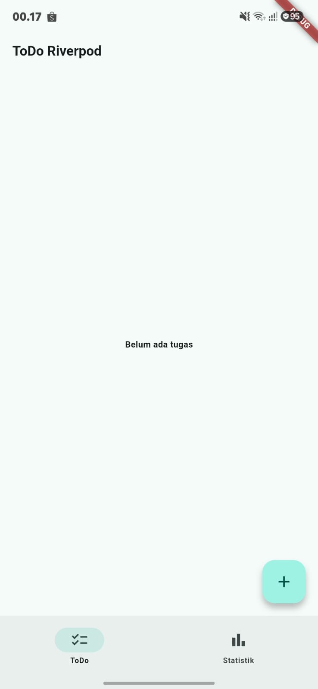
</td>
<td align="center" width="50%">
<b>Halaman Statistik (<code>/stats</code>)</b><br>
<sub>Total Tugas, Tugas Selesai, Tugas Aktif</sub>
<br><br>
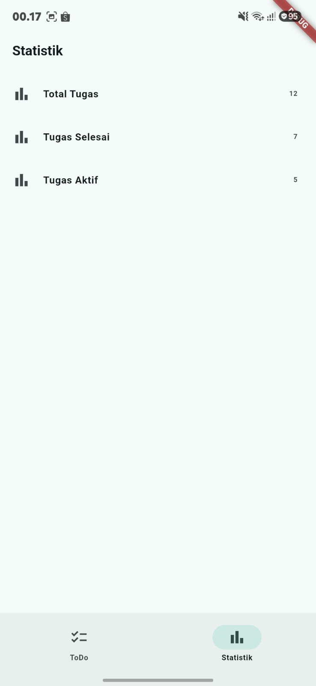
</td>
</tr>
</table>

### Bukti alur ToDo end-to-end (screenshot)

<table>
<tr>
<td align="center" width="20%"><b>1. Halaman kosong</b><br><sub>"Belum ada tugas"</sub></td>
<td align="center" width="20%"><b>2. Dialog tambah tugas</b><br><sub>isi "matematika"</sub></td>
<td align="center" width="20%"><b>3. Tugas ditambahkan</b><br><sub>muncul di list</sub></td>
<td align="center" width="20%"><b>4. Tugas selesai</b><br><sub>checkbox tercentang</sub></td>
<td align="center" width="20%"><b>5. Tugas dihapus</b><br><sub>kembali kosong</sub></td>
</tr>
<tr>
<td align="center">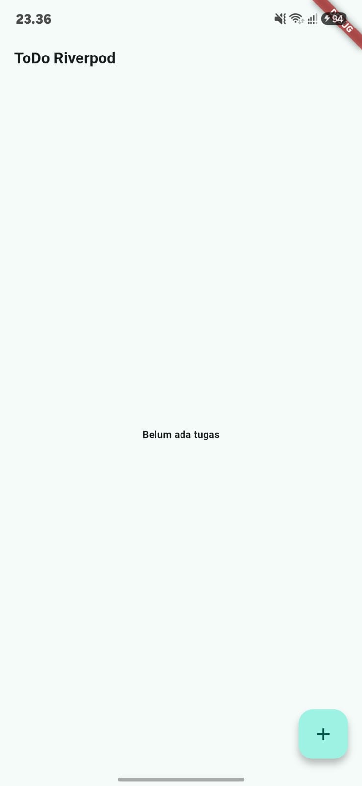</td>
<td align="center">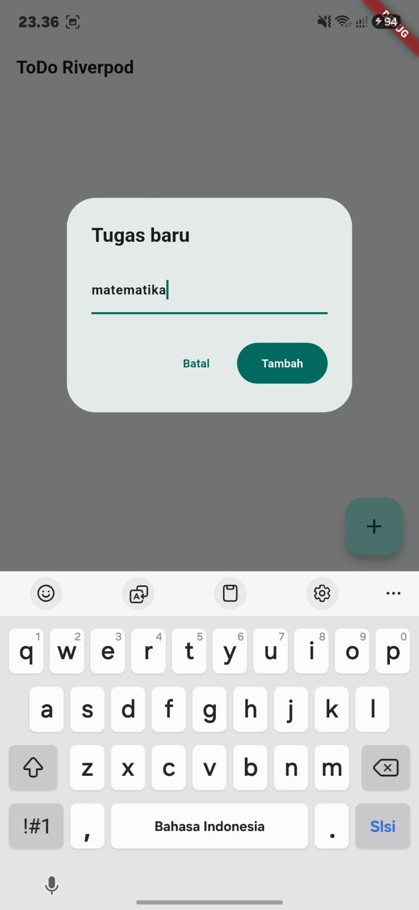</td>
<td align="center">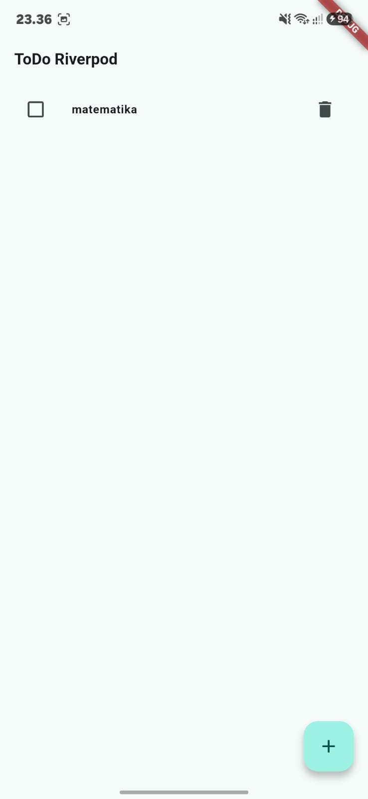</td>
<td align="center">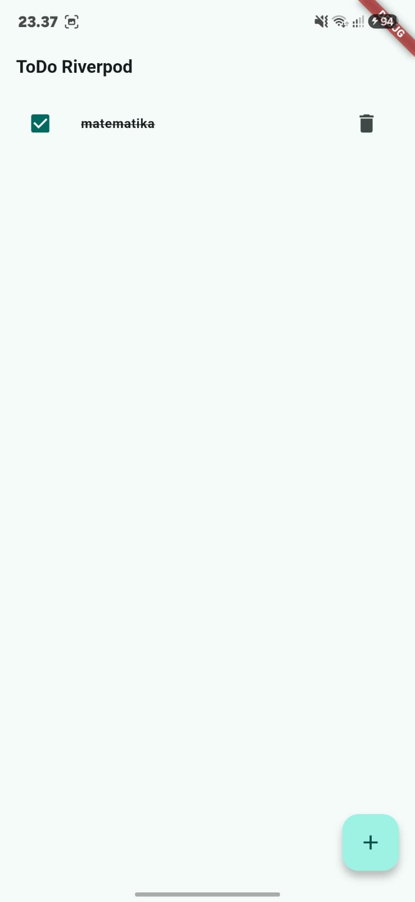</td>
<td align="center">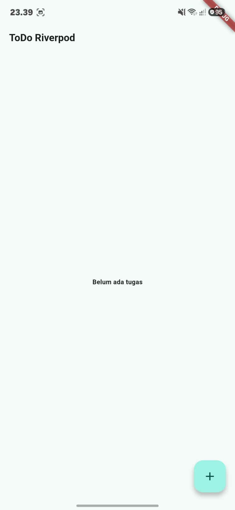</td>
</tr>
</table>

Urutan di atas membuktikan update state ToDo bersifat immutable end-to-end: dari kosong → ditambahkan → ditandai selesai (`isDone: true`, teks tercoret) → dihapus → kembali kosong.

---

## 3. Testing — hasil eksekusi

### 3.1 `flutter test`

```
PS ...\week3_todo> flutter test
00:12 +6: All tests passed!
```

**6 test lulus semua**, mencakup:
- Widget test menambah tugas baru (dari instruksi tugas).
- Unit test notifier `ProductNotifier`/`AsyncNotifier` (loading/error/success + retry).
- Test provider filter (`incompleteTodosProvider`).

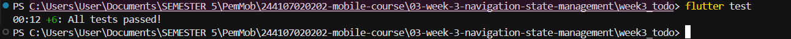

### 3.2 `flutter analyze`

```
PS ...\week3_todo> flutter analyze
Analyzing week3_todo...
No issues found! (ran in 23.4s)
```

**Tidak ada issue/warning:**

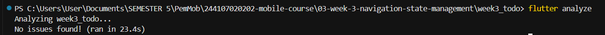

---

## 4. Checklist Verifikasi Mandiri

- [x] Navigasi GoRouter bekerja: pindah halaman (`/` ↔ `/stats`), tombol back berfungsi, akses path langsung juga diuji.
- [x] `ProviderScope` membungkus root aplikasi (`main.dart`); state ToDo terbukti bertahan saat berpindah tab ke Statistik dan kembali lagi.
- [x] UI `AsyncValue` menangani ketiga state (loading, error, success)
- [x] `flutter analyze` tanpa issue dan seluruh `flutter test` lulus (6/6) 
- [x] Hasil AI diverifikasi dan didokumentasikan pada folder `docs/` (dokumen ini).

---

## 5. Tanggung Jawab Teknis

- **Prompt yang digunakan**: dicatat lengkap di 1.1.
- **Output awal AI**: diringkas di 1.2 (kode asli tidak disertakan verbatim di dokumen ini; struktur & pola kode dijelaskan secara naratif).
- **Perbaikan yang dilakukan**: dirinci pada tabel verifikasi 1.5.
- **Hasil testing**: `flutter test` (6 passed) dan `flutter analyze` (no issues) 
- Saya (penyusun) dapat menjelaskan setiap baris kode hasil AI saat demo, termasuk alasan setiap perbaikan pada 1.5.