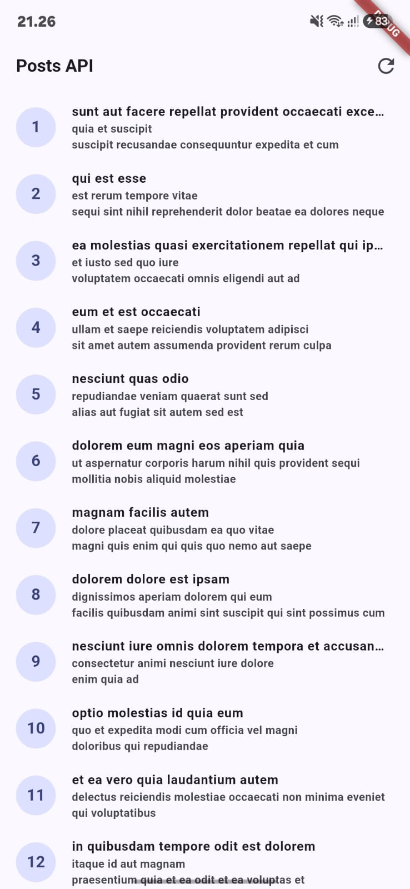
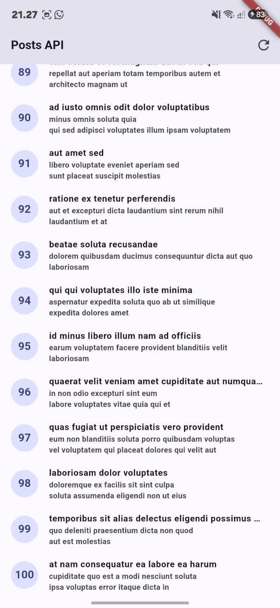
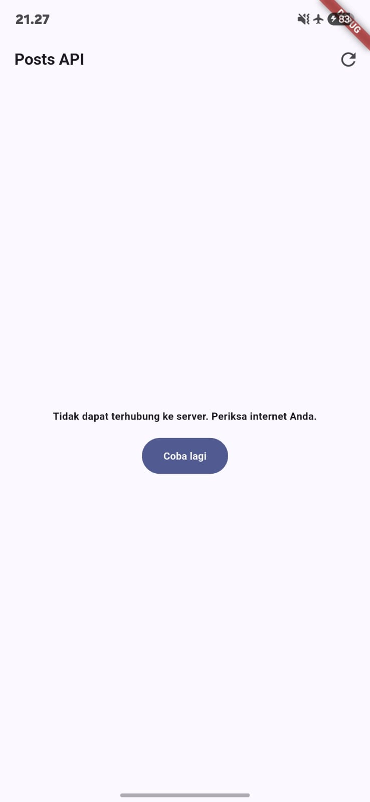
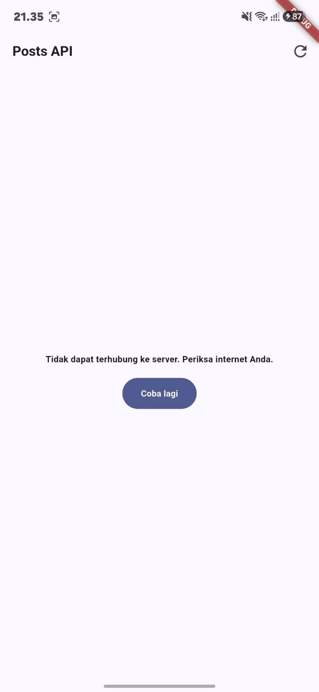
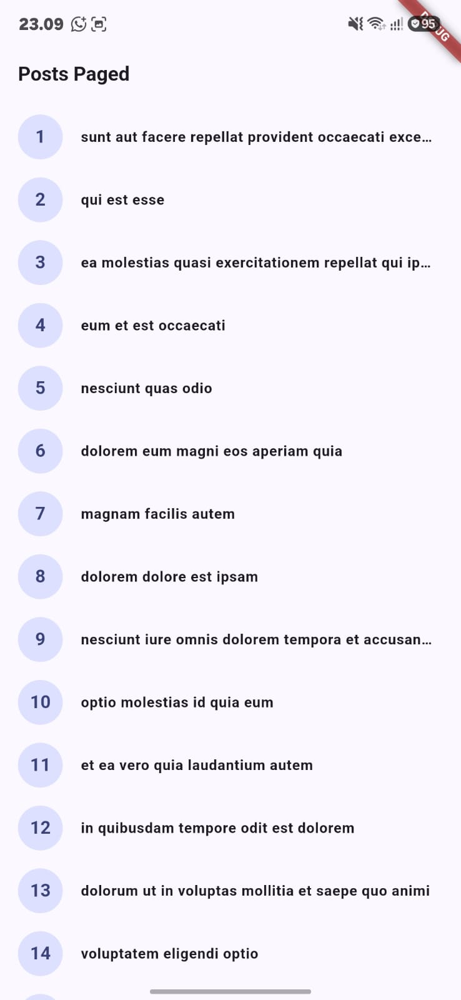
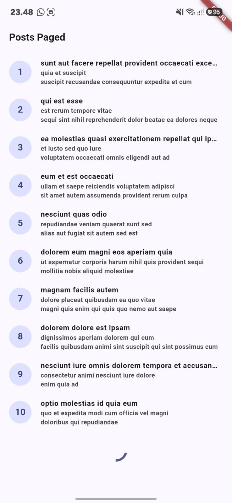
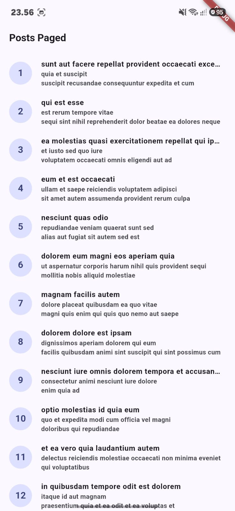
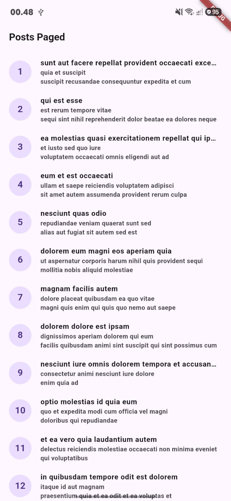
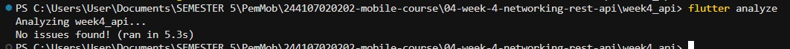
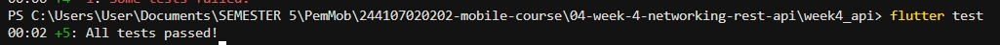

# Week 4 — Networking & REST API (`week4_api`)

Aplikasi Flutter yang mengambil data dari [JSONPlaceholder](https://jsonplaceholder.typicode.com/) menggunakan **Dio** sebagai HTTP client dan **flutter_riverpod** sebagai state management. Proyek ini mencakup tiga praktikum (Dio + model, provider + error handling, pagination), refactoring challenge, AI challenge, serta unit test.

| Item | Keterangan |
|---|---|
| Endpoint utama | `GET /posts`, `GET /posts?_page=N&_limit=10` |
| HTTP client | Dio (timeout 10 detik, `LogInterceptor`) |
| State management | Riverpod 3 (`AsyncNotifierProvider`, `NotifierProvider`) |
| Routing | GoRouter (`/`, `/post/:id`) |
| Testing | 5 test lulus, `flutter analyze` tanpa issue |

---

## 1. Setup dan struktur proyek

```bash
flutter create week4_api
cd week4_api
flutter pub add dio flutter_riverpod go_router
```

```
lib/
├── main.dart
├── data/
│   ├── api_client.dart          # konfigurasi Dio terpusat
│   ├── providers.dart           # provider + AsyncNotifier
│   ├── paged_posts.dart         # notifier pagination
│   ├── network_errors.dart      # friendlyErrorMessage (hasil refactor)
│   ├── models/
│   │   └── post.dart
│   └── repositories/
│       └── post_repository.dart
├── pages/
│   ├── post_list_page.dart
│   ├── paged_post_page.dart
│   └── post_detail_page.dart
└── widgets/
    └── post_tile.dart           # hasil ekstraksi widget
test/
└── post_test.dart
docs/
└── screenshots/
```

Arsitektur mengikuti alur satu arah: **UI → Provider → Repository → Dio**. Widget tidak pernah memanggil Dio secara langsung.

---

## 2. Praktikum 1 — Dio dan model data

### Model `Post` dengan `fromJson` aman null

```dart
factory Post.fromJson(Map<String, dynamic> json) {
  return Post(
    userId: (json['userId'] as num?)?.toInt() ?? 0,
    id: (json['id'] as num?)?.toInt() ?? 0,
    title: json['title'] as String? ?? '',
    body: json['body'] as String? ?? '',
  );
}
```

Cast defensif (`as String? ?? ''`) dipakai karena respons API nyata sering tidak konsisten dengan dokumentasi: field bisa hilang atau bertipe lain. Pola ini mencegah crash `type 'Null' is not a subtype of type 'String'` yang merupakan bug paling umum pada integrasi API pertama.

### Konfigurasi Dio terpusat

Semua konfigurasi jaringan hidup di `api_client.dart`: `baseUrl`, `connectTimeout` dan `receiveTimeout` 10 detik, header `Accept`, serta `LogInterceptor` untuk debugging. Dio dipilih dibanding package `http` karena menyediakan timeout per-request, interceptor, dan error terstruktur `DioException` dengan properti `type` — semuanya tanpa boilerplate tambahan.

### Repository sebagai pintu data

`PostRepository` hanya bertugas memanggil endpoint dan memetakan JSON ke model. Repository **tidak** menangkap exception dan **tidak** menyentuh UI. Exception sengaja dibiarkan naik agar provider mengubahnya menjadi `AsyncError` secara otomatis.

```dart
Future<List<Post>> fetchPosts() async {
  final response = await _dio.get<List>('/posts');
  final data = response.data ?? [];
  return data.whereType<Map<String, dynamic>>().map(Post.fromJson).toList();
}
```

---

## 3. Praktikum 2 — Provider dan error handling

`PostListNotifier extends AsyncNotifier<List<Post>>` mengembalikan `repository.fetchPosts()` dari `build()`, sehingga exception otomatis menjadi `AsyncError` — ekuivalen deklaratif dari `AsyncValue.guard`. Retry otomatis Riverpod 3 dinonaktifkan (`retry: (retryCount, error) => null`) agar error bersifat final dan test tidak menggantung menunggu retry.

`friendlyErrorMessage()` menerjemahkan `DioException` teknis menjadi kalimat yang dapat dibaca pengguna:

| `DioExceptionType` | Pesan yang ditampilkan |
|---|---|
| `connectionTimeout`, `sendTimeout`, `receiveTimeout` | Koneksi lambat atau timeout. Periksa internet Anda lalu coba lagi. |
| `connectionError` | Tidak dapat terhubung ke server. Periksa internet Anda. |
| `badResponse` 404 | Data tidak ditemukan (404). |
| `badResponse` 401 / 403 | Akses ditolak. Periksa kredensial Anda. |
| `badResponse` lainnya | Server bermasalah (kode). Coba lagi nanti. |
| default / non-Dio | Terjadi kesalahan jaringan / tak terduga. |

### Empat state UI

`postsAsync.when(...)` memberi tampilan berbeda untuk **loading**, **error**, **empty**, dan **success**.

Loading indicator muncul sebentar, lalu seluruh 100 post tampil dalam `ListView.builder` dengan `CircleAvatar` berisi id, judul 1 baris, dan body 2 baris (keduanya `TextOverflow.ellipsis`). Scroll sampai bawah memastikan seluruh data terparsing sampai id 100.

Dua skenario error diuji: mode pesawat, dan `baseUrl` yang sengaja disalahkan meski Wi-Fi aktif. Keduanya menghasilkan `DioExceptionType.connectionError` dengan pesan ramah plus tombol **Coba lagi**, bukan stack trace mentah. Setelah internet dinyalakan dan tombol ditekan (`ref.invalidate(postListProvider)`), provider dibangun ulang dan data tampil normal tanpa restart aplikasi. `baseUrl` dikembalikan ke nilai semula setelah pengujian.

<table>
  <tr><th align="center">Success — 100 posts</th><th align="center">Akhir data (id 100)</th><th align="center">Error — mode pesawat</th><th align="center">Error — baseUrl salah</th><th align="center">Pulih — Coba lagi</th></tr>
  <tr><td align="center"></td><td align="center"></td><td align="center"></td><td align="center"></td><td align="center"></td></tr>
</table>

State **empty** ditangani dengan pengecekan `posts.isEmpty` yang menampilkan teks "Belum ada data dari server." Kondisi ini tidak muncul pada JSONPlaceholder karena endpoint selalu mengembalikan 100 item, tetapi tetap diimplementasikan karena API produksi bisa saja mengembalikan list kosong.

---

## 4. Praktikum 3 — Pagination dasar

API dengan data besar tidak dikirim sekaligus. JSONPlaceholder mendukung query `?_page=N&_limit=M`, jadi repository ditambah `fetchPostsPage({required int page, int limit = 10})`.

`PagedPostsNotifier extends Notifier<PagedPostsState>` menyimpan `items`, `page`, `isLoadingMore`, `hasMore`, dan `error` dalam satu state class. Halaman pertama dimuat lewat `Future.microtask(loadFirstPage)` di dalam `build()`.

Guard ganda yang paling penting:

```dart
if (state.isLoadingMore || !state.hasMore) return;
```

Baris ini mencegah request ganda saat scroll listener terpanggil berkali-kali dalam satu gestur, sekaligus menghentikan request ketika data sudah habis. `hasMore` dihitung dari `items.length == 10` — jika halaman terakhir mengembalikan kurang dari limit, berarti data sudah habis.

Ketika `loadNextPage()` gagal, data lama **dipertahankan** (`items: currentItems`) sehingga pengguna tidak kehilangan daftar yang sudah ter-scroll.

### Infinite scroll

`ScrollController` memicu halaman berikutnya 200px sebelum ujung list:

```dart
if (_controller.position.pixels >=
    _controller.position.maxScrollExtent - 200) {
  ref.read(pagedPostsProvider.notifier).loadNextPage();
}
```

Halaman pertama (10 item) tampil lebih dulu. Saat mendekati ujung list, indikator kecil muncul di bawah item terakhir tanpa menghapus data lama, lalu digantikan item halaman berikutnya (lihat galeri di bagian 5).

Item bertambah secara bertahap tanpa reload penuh, dan ketika `hasMore` menjadi `false` list menampilkan teks "Semua data termuat."

---

## 5. Refactoring challenge

| # | Refactor | Hasil |
|---|---|---|
| 1 | Ekstrak `PostTile` | `ListView.builder` menjadi 3 baris; tile bisa diuji terpisah dan dipakai ulang oleh halaman paged maupun non-paged |
| 2 | Pindahkan `friendlyErrorMessage` ke `lib/data/network_errors.dart` | Halaman list dan paged mengimpor fungsi yang sama, tidak ada duplikasi pemetaan error |
| 3 | Tambah detail post via GoRouter `/post/:id` | Tap tile membuka halaman detail dengan `title` dan `body` lengkap |

Setelah ekstraksi `PostTile`, halaman paged ikut menampilkan subtitle body dengan konsistensi visual yang sama seperti halaman list. Rute `/post/:id` mengambil id dari path parameter; state detail dibaca dari list yang sudah dimuat bila tersedia, atau diambil ulang lewat repository jika halaman dibuka langsung (deep link). Judul dan body ditampilkan penuh tanpa `ellipsis`.

<table>
  <tr><th align="center">Paged — halaman 1</th><th align="center">Memuat halaman berikut</th><th align="center">Paged + PostTile</th><th align="center">Paged final</th><th align="center">Detail post (GoRouter)</th></tr>
  <tr><td align="center"></td><td align="center"></td><td align="center"></td><td align="center"></td><td align="center"></td></tr>
</table>

---

## 6. AI Challenge

### Prompt yang digunakan

```
Buatkan repository layer Flutter untuk endpoint GET /comments?postId={id}
dari JSONPlaceholder menggunakan Dio + flutter_riverpod.
Requirements:
- Model Comment dengan fromJson aman null (postId, id, name, email, body).
- CommentRepository dengan method fetchComments(postId) + timeout 10 detik.
- AsyncNotifierProvider dengan penanganan error otomatis (AsyncError)
  dan fungsi pesan error ramah pengguna untuk timeout, connection error, 404, dan 500.
- Satu unit test untuk fromJson dengan field yang hilang.
Jelaskan setiap bagian kode dalam komentar.
```

### Hasil verifikasi

| Poin verifikasi | Temuan | Tindakan perbaikan |
|---|---|---|
| UI memanggil Dio langsung? | Tidak — akses data lewat `CommentRepository` + provider | Sesuai, dipertahankan |
| `fromJson` aman null? | Sebagian; `email` dan `name` sempat memakai cast langsung `as String` | Diubah ke pola `as String? ?? ''` seperti pada `Post` |
| Semua `DioExceptionType` dipetakan? | Awalnya hanya `connectionTimeout` dan `badResponse` | Ditambahkan `sendTimeout`, `receiveTimeout`, `connectionError`, dan cabang `default` |
| `baseUrl`/timeout terpusat? | Tidak — timeout ditulis ulang di dalam method repository | Dipindahkan ke `createDio()` di `api_client.dart` sehingga satu sumber konfigurasi |
| Test menguji field hilang? | Hanya happy path pada versi awal | Ditambahkan test field hilang + edge case tipe salah (`id` berupa `String`) |
| `flutter analyze` & `flutter test` lolos? | Awalnya ada warning import tidak terpakai dan `print` di catch | Import dibersihkan, `print` dihapus, exception dibiarkan naik ke provider |

Catatan tambahan: output AI juga sempat memakai retry default Riverpod sehingga test menggantung. Diperbaiki dengan `retry: (retryCount, error) => null` seperti pada `postListProvider`.

Prompt, output awal AI, diff perbaikan, dan log testing disimpan pada folder `docs/`.

---

## 7. Testing

`test/post_test.dart` menggunakan `FakePostRepository` yang meng-override `fetchPosts()` dan `fetchPostsPage()`, sehingga **tidak ada request HTTP sungguhan** di dalam test. Repository palsu diinjeksikan lewat `postRepositoryProvider.overrideWithValue(...)` pada `ProviderContainer`.

Helper `readPostsOnce()` dan `readPostsErrorOnce()` membaca state pertama yang bukan loading lewat `container.listen` + `Completer`, sehingga test menyelesaikan hasil pertama tanpa menunggu retry.

Cakupan test:

1. `fromJson` aman terhadap field yang hilang (`{'id': 7}` → title `''`, userId `0`).
2. `friendlyErrorMessage` untuk `connectionError` menghasilkan pesan yang mengandung "terhubung".
3. Provider sukses dengan repository palsu.
4. Provider error dengan repository palsu (`isA<DioException>()`).
5. Edge case tambahan milik sendiri untuk tipe data yang tidak sesuai dokumentasi.

```bash
flutter analyze
flutter test
```

<table>
  <tr><th align="center">flutter analyze</th><th align="center">flutter test</th></tr>
  <tr><td></td><td></td></tr>
</table>

`flutter analyze` selesai tanpa issue, dan seluruh 5 test lulus.

---

## 8. Checklist verifikasi mandiri

- [x] UI tidak memanggil Dio langsung; semua akses data lewat repository + provider
- [x] Empat state tampil benar: loading, error (+ retry), empty, success
- [x] Pagination menambah data saat scroll, tanpa request ganda, dengan indikator akhir data
- [x] `flutter analyze` tanpa issue dan seluruh test lulus
- [x] Hasil AI diverifikasi dan didokumentasikan pada folder `docs/`

## 9. Kesalahan umum yang dihindari

- Memanggil Dio langsung dari widget alih-alih lewat repository.
- Menelan exception dengan `catch` kosong sehingga kegagalan tidak terlihat.
- Menampilkan pesan teknis mentah (stack trace) kepada pengguna.
- Lupa menangani empty state sehingga layar kosong tanpa penjelasan.
- Tidak memasang timeout sehingga UI menggantung selamanya.
- Melupakan guard `isLoadingMore` sehingga scroll memicu request ganda.